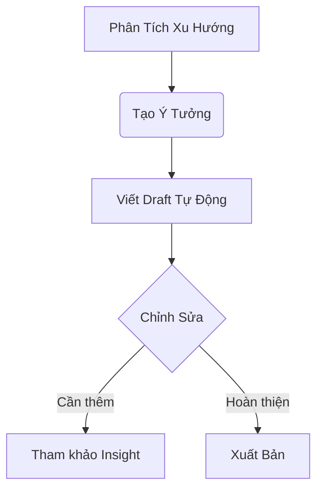

# Large Language Model (LLM) là gì? Xu Hướng AI Đột Phá & Ứng Dụng Thực Tế

Mô Hình Ngôn Ngữ Lớn (LLM) đại diện cho bước đột phá trong trí tuệ nhân tạo, sử dụng kỹ thuật mạng nơ-ron với tham số khổng lồ để xử lý ngôn ngữ tiên tiến.

*Mô hình LLM ứng dụng trong đa lĩnh vực từ giáo dục đến y tế*

## 5 Đặc Điểm Nổi Bật Của LLM
1. **Khả năng hiểu ngữ cảnh sâu** - Phân tích mối quan hệ giữa các từ trong phạm vi văn bản dài
2. **Học đa nhiệm** - Cùng lúc thực hiện dịch thuật, tóm tắt, trả lời câu hỏi
3. **Tối ưu hóa liên tục** - Cập nhật kiến thức thông qua fine-tuning
4. **Xử lý đa ngôn ngữ** - Hiểu và tạo văn bản trong 100+ ngôn ngữ
5. **Tích hợp đa phương thức** - Kết hợp text, hình ảnh, giọng nói (phiên bản mới)

## Bảng So Sánh Các Thế Hệ LLM Phổ Biến

| Model | Nhà phát triển | Ứng dụng chính | Chi phí (USD/1k tokens) |
|-------|---------------|----------------|-------------------------|
| GPT-4 Turbo | OpenAI | Chatbot, Content Creation | $0.01 |
| Claude 3 | Anthropic | Phân tích tài liệu | $0.015 | 
| Gemini 1.5 | Google | Tìm kiếm đa phương thức | Miễn phí |
| LLaMA 3 | Meta | Research, On-device AI | Open-source |
| Mistral Large | Mistral AI | Tối ưu cho tiếng Việt | $0.0005 |

## Ứng Dụng Vàng Trong Doanh Nghiệp

### 1. Tự Động Hóa Customer Service
- Chatbot xử lý 80% truy vấn cơ bản
- Phân tích tâm lý khách hàng qua hội thoại
- Gợi ý giải pháp theo lịch sử tương tác

### 2. Tối Ưu Content Marketing

### 3. Phân Tích Dữ Liệu Phi Cấu Trúc
- Tóm tắt báo cáo dài 100+ trang
- Trích xuất thông tin từ email, hợp đồng
- Nhận diện xu hướng từ feedback khách hàng

### 4. Tối ưu Customer Support tại Bank
- **Bài toán**: Giảm 40% workload cho bộ phận CSKH
- **Giải pháp**: Triển khai LLM-based chatbot
- **Kết quả**:
  - Xử lý 85% truy vấn thường gặp
  - Tiết kiệm ~2 tỷ VND/tháng

## Cách Doanh Nghiệp Bắt Đầu Với LLM
1. Xác Định Use Case - Chọn 1-2 bài toán cụ thể (ví dụ: tự động hóa FAQ)
2. Chọn Nền Tảng:

- OpenAI GPT cho ứng dụng đa năng

- Google Vertex AI cho hệ thống lớn

- Mã nguồn mở (LLaMA) cho tùy biến cao

- POC (Proof of Concept) - Triển khai thử nghiệm trong 2-4 tuần

- Đánh Giá & Mở Rộng - Đo lường KPI trước khi scale

## 3 Lưu ý Khi Triển Khai LLM
### ⚠️ Chất Lượng Dữ Liệu Đầu Vào
"Rác vào - Rác ra": Cần làm sạch dữ liệu training

### ⚠️ Vấn Đề Bảo Mật
Không dùng LLM công khai cho dữ liệu nhạy cảm

### ⚠️ Chi Phí Ẩn
- Tính toán kỹ chi phí token khi scale hệ thống

## Xu Hướng LLM trong tương lai
- Small Language Model: Mô hình nhỏ hơn nhưng hiệu quả cao
- AI Agent: LLM + Tự động hóa quy trình
- LLM On-Device: Chạy trực tiếp trên smartphone

## Kết Luận: LLM - Đòn Bẩy Chuyển Đổi Số

**Tóm lược giá trị cốt lõi:**  
Large Language Model không còn là công nghệ tương lai - nó đã trở thành *"nền tảng kỹ thuật số"* thiết yếu cho mọi doanh nghiệp muốn dẫn đầu trong kỷ nguyên AI. Từ tự động hóa quy trình đến phân tích insight khách hàng, LLM đang phá vỡ mọi giới hạn về hiệu suất và sáng tạo.

**Bài học then chốt:**  
- Ưu tiên **chất lượng dữ liệu** hơn quy mô mô hình  
- Kết hợp **kiến thức chuyên ngành** + AI để tạo lợi thế cạnh tranh  
- Bắt đầu từ **use case nhỏ**, đo lường ROI trước khi scale  
